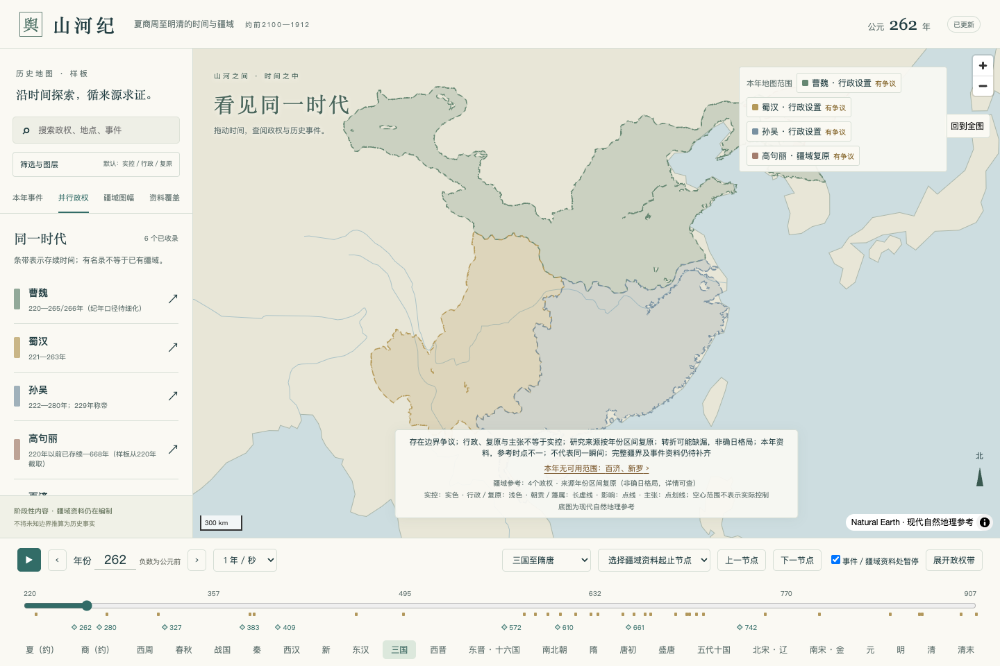
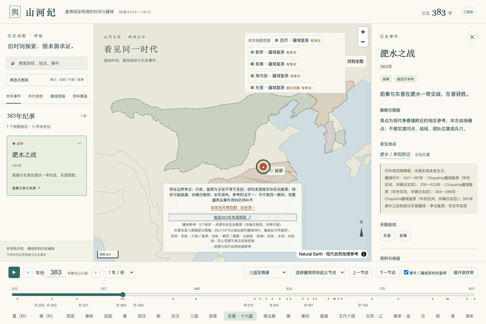
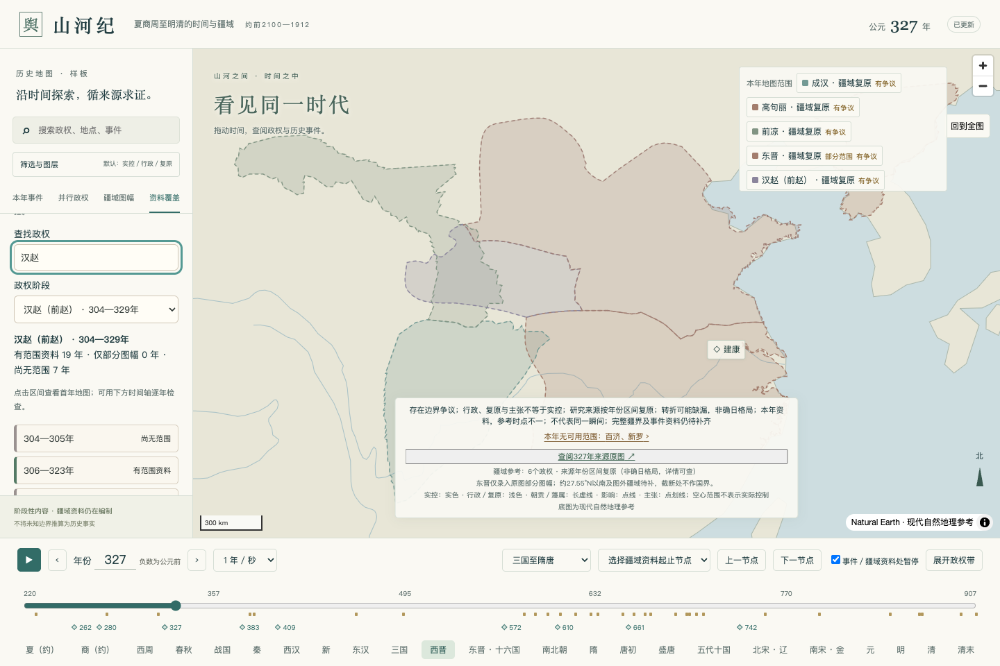
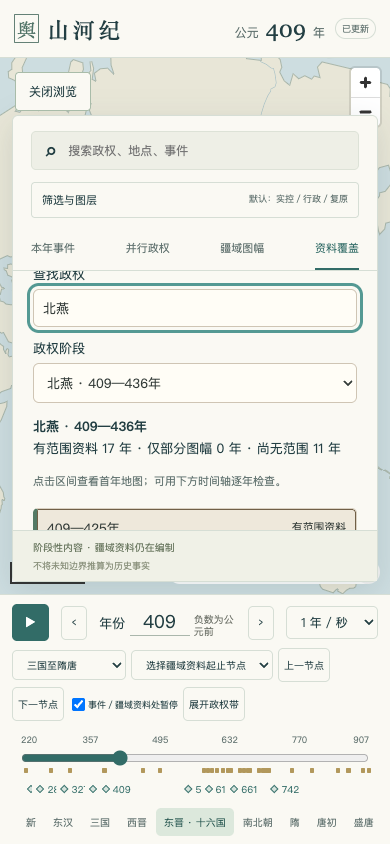

# 山河纪

**Shanheji · 中国历史疆域与事件时间轴地图**

> 沿时间探索，循来源求证。

山河纪将历史年份、并行政权、疆域资料和重大事件放在同一张可交互地图中。拖动时间轴、输入年份或逐年播放，即可查看该时点已有资料支持的疆域分布；点击事件亮点，进一步了解事件、相关政权、地点与来源。

目前时间范围为**约公元前2100年至公元1912年**，从夏商周至明清，以中国历史各政权及已收录周边政权为内容范围。原三国至隋唐样板保留，并持续扩充其他时期。完整周边国家及全球内容尚未接入。

**当前交付：可运行的交互应用与阶段性历史内容。历史疆域样板尚未完成。**

[页面预览](#页面预览) · [快速启动](#快速启动) · [如何探索](#如何探索) · [内容状态](#内容状态) · [数据构建](#数据构建) · [资料索引](#资料索引)

## 功能概览

| 功能             | 使用方式与表现                                                                         |
| ---------------- | -------------------------------------------------------------------------------------- |
| 时间轴与年份查询 | 输入年份、拖动滑块、逐年播放，地图随查询年份更新；支持前后年份、前后节点和23个时期入口 |
| 疆域与并行政权   | 同年显示多政权资料，区分实控、行政设置、朝贡／藩属、影响与主张，支持图层和地区筛选     |
| 事件亮点         | 已有坐标的事件显示地图亮点，支持聚合与点击查看；未定位事件保留在文字列表               |
| 详情与检索       | 查看事件、政权、地点、关系、日期精度及逐项来源，支持异名搜索                           |
| 来源原图         | 查看已收录图幅、作者、许可、适用年代和局部范围说明                                     |
| 逐年资料清单     | 搜索政权，查看有范围资料、仅部分图幅和缺失区间，点击区间跳转地图                       |
| 桌面与手机       | 桌面侧栏、手机资料抽屉，支持键盘操作与降低动效；无 WebGL 时保留文字浏览                |
| 加载与恢复       | 资源校验、过期响应隔离、超时重试，避免较早请求覆盖最新年份                             |

## 页面预览

以下为本地应用的实际截图。截图展示交互与资料呈现方式，研究轮廓、行政参考和部分图幅的含义仍以页面说明及来源记录为准。

### 同一时点的疆域分布

262年三国并立：查看魏、蜀、吴的行政范围参考，通过底部时间轴切换年份。



### 点击历史事件

383年淝水之战：点击地图亮点展开事件详情，查看简介、相关政权、地点精度和资料来源。亮点为现代寿春附近地区参考，不是古战场确点。



### 按政权查看逐年资料覆盖

327年汉赵资料清单：地图展示该年已录入范围，左侧列出覆盖与缺失区间，方便逐年检查。



### 手机端浏览

409年北燕资料清单：在手机资料抽屉中查看政权阶段与年度覆盖，底部保留年份输入、播放和节点跳转。



更多截图与各版本验收记录见 [功能验收](docs/qa/acceptance.md)。

## 快速启动

已在 **Node.js 22.23.2** 下验证。日常查看应用只需 Node.js 和 npm；已发布地图资源随仓库提供，无需先运行 Python 数据构建。

```sh
git clone https://github.com/lisongjianustc/shanheji.git
cd shanheji
npm ci
npm run dev -- --port 4173 --strictPort
```

开发页面：<http://127.0.0.1:4173/>。私有仓库克隆需要使用具有访问权限的 GitHub 账号。

构建并启动本地生产预览：

```sh
npm run build
npx vite preview --host 127.0.0.1 --port 4174 --strictPort
```

预览页面：<http://127.0.0.1:4174/>。构建结果在 `dist/`，当前未部署公网。端口如被其他程序占用，可改用空闲端口。

## 如何探索

1. **选择年份**：在底部输入年份并确认，或拖动时间轴。公元前用负数，例如 `-300`；没有0年，前1年直接转入公元1年。
2. **观察地图更新**：页面显示“已更新”后，查看当前地图疆域图例。绿色疆域节点、资料年份下拉框与上一／下一节点可快速定位已有资料。
3. **查看事件**：点击地图亮点或“本年事件”条目，阅读简介、时间与位置精度、关联政权及来源。
4. **查看并行政权**：在“并行政权”栏目或展开政权时间带，了解同一时期的多个政权。
5. **核对来源与缺口**：在“疆域图幅”查阅原图，在“资料覆盖”搜索政权并查看逐年清单。
6. **连续播放**：选择播放速度；可开启经过事件／疆域资料节点时暂停，便于逐项查看。

### 建议探索的年份

| 年份                       | 可以查看的内容                                       |
| -------------------------- | ---------------------------------------------------- |
| 公元前300年（输入 `-300`） | 战国七雄的研究轮廓                                   |
| 262年                      | 魏、蜀、吴同时期行政范围参考                         |
| 280年                      | 西晋约280年部分图幅与来源原图                        |
| 327年                      | 汉赵、后赵轮廓与东晋部分图幅，以及逐年资料清单       |
| 383年                      | 淝水之战亮点、东晋战前部分图幅与相关政权             |
| 572年                      | 北周、北齐、陈、西梁（江陵）行政范围参考             |
| 610年、742年               | 隋朝部分范围、唐代东部部分范围与图外缺口说明         |
| 1120年                     | 宋、辽、金、夏的研究轮廓                             |
| 1420年、1820年             | 明／清及已收录朝鲜、日本政权的研究轮廓；部分范围仍缺 |

## 内容状态

当前由9个时段数据包组织内容。全部4012个年份已核对查询与清单一致；3331年有任一已录入范围，681年全图无范围资料。**有任一范围资料，不等于当年疆域已完整覆盖。**

| 项目         | 当前状态                                                                                                                                                                            |
| ------------ | ----------------------------------------------------------------------------------------------------------------------------------------------------------------------------------- |
| 政权目录     | 99个；增加甘州回鹘、高昌回鹘、西燕、岐（李茂贞）、西辽、大理与大中国，包含高丽、朝鲜、大韩帝国与镰仓、足利、德川幕府；完整周边仍缺                                                  |
| 历史事件     | 75件，跨包引用78条，页面按编号去重                                                                                                                                                  |
| 地点         | 17个，均有目录内部分年份的近似参考位置；遗产位置不表示事件发生确点                                                                                                                  |
| 来源疆域版本 | 592条唯一几何／649条引用：原有12条、3条东晋部分图幅与4条逐年缺口来源范围，加573条经身份与年代筛查的Cliopatria年份区间复原；有范围不表示完整疆域                                     |
| 来源参考图   | 262、572年已配准行政参考；610、742年为部分来源范围，连同376年东晋与前秦、秦代、约1580年明代、1820年清代原图，以及327、383、409年东晋部分图幅，另加约280年西晋图，共十二图可放大查阅 |
| 审查         | agent 对照公开资料；未经历史专家审定                                                                                                                                                |

打开应用默认展示661年行政范围参考。输入或拖动年份、播放经过节点时，主地图自动更新已有边界；时间轴下方的绿色疆域节点可以直接点击，上一／下一节点包括事件和疆域资料年份。默认显示实控、行政设置和年份区间复原，浅色及争议提示保留，主张单独开启。未知年份不外推；下拉入口和上一／下一节点包含资料起点与结束后的切换年。

262年同时显示魏、蜀、吴，572年同时显示北周、北齐、陈、西梁（江陵）；主图政权标识可点击查看依据。约610年显示隋朝部分行政参考，西部渐隐及画布外不补界，资料裁切线不绘制为国界。742年显示105°E以东的唐代部分行政参考，排除西部异时资料；裁切经线不是历史边界。“疆域图幅”提供本年全部已录入政权的入口，以及十二张来源原图。

新增可查看公元前300年战国七雄、1120年宋辽金夏、1420年明／朝鲜／足利幕府、1820年清／朝鲜／德川幕府的研究轮廓，以及634年大明宫、652年大雁塔事件点。1000年另可查看大理国947—1055年的研究范围；1056年起缺少可用范围，1094—1096年中断及大中阶段不使用旧图补齐。研究区间不表示确日格局。德川只保留完整源图内本州、四国、九州及附近岛屿组成部分；琉球、虾夷及北方争议范围未录入。淝水之战亮点为现代寿春附近参考，不是古战场确点。

推荐查看262、572年（多政权行政范围参考）、610年（隋朝部分范围）、742年（唐代东部部分范围），460年（云冈事件点）、383年（淝水之战与并行政权）、589年（隋灭陈）、672年（龙门营造）。229年古武昌称帝、317年东晋建立、794年迁都平安京也有地区参考亮点，点击说明非宫殿或仪式确点。690年改国号周、705年唐朝复位及700年金简纪年也有地区参考亮点；700年的传统历日未转为公历确日。只有有坐标的事件才在地图标点。

387—393年新增西燕、911—921年新增岐（李茂贞）、1126—1215年新增西辽研究范围，随当前年份切换；394、922、1216年分别保留对应缺口。907、924年凤翔纪事可点击。376年东晋与前秦原图可以查阅，但该年东晋叠加疆域仍缺。

甘州回鹘896—989、高昌回鹘888—1138新增8段研究范围；990年移除甘州旧图，1139年起高昌仍缺范围。866、1028、1209年有地区参考亮点；1209归附蒙古后保留高昌本土阶段目录。

不能将当前地图用于引用完整古代疆界。空白表示尚缺资料，不表示当时没有国家、疆域或事件。现代海岸与河流仅作地理参考。未知疆域不插值。

当前版本 `477a4a361d8b0b61`，本轮对照清单补入西晋约280年部分范围、汉赵与后赵约327年轮廓、北燕409年轮廓，见[逐年缺口补入记录](docs/data/jin-gap-snapshots-2026-10-07.md)。当前逐年缺口见[正式查询清单](docs/data/annual-query-sweep.md)，所有来源资料可用性另见[年度可用性表](docs/data/annual-availability.md)。东晋已有327、383、409三年部分图幅，其余101年仍无范围；409年西秦线条归属未确认，继续保留缺口。

逐包情况见 `docs/data/package-reports/`（旧版统计保留，当前统计以上述接入记录为准）；原始范围登记 `data/audits/scope-register.json` 保留，`scope-register-v2.json` 增加收录进度，`scope-register-v3.json` 登记本轮扩展。各包的 `coverage` 明示未完成部分。

## 资料与后续编制

主要来源为机构年代资料、Met历史时间表、地方政府历史介绍、UNESCO遗产条目及IDP《金刚经》记录。链接与具体定位在 `data/catalog/sources.json` 和每条记录的 `evidence` 中。独立短摘要未复制原网页全文或地图。

机构来源也有错误或不同口径。已排除明显错误记录，日期精度不足时保留不确定范围。唐与武周用分段存续处理；晋以统一身份、分段名称处理。原图及其许可并未由代码校验代替。

下一步需要具有**年份、图幅／页码、边界性质、使用条件**的历史地图集或疆域矢量，尤其是十六国各政权、隋统一前后、唐中晚期实际控制与周边疆域。旧版 `HistoryMap` 的示意边界未直接升级为史实。

数据流程：来源登记 → 记录级编制 → 日期／位置／关系核查 → 人工或agent明确记录审查 → 校验 → 本地发布。`review.status=verified` 不能由测试通过自动赋予。新增疆域必须记录配准控制点、比例尺、误差和解释版本。

## 数据构建

网页运行使用已提交的 `public/data`；只有重新发布几何数据时需要项目Python环境：

```sh
python3 -m venv .venv
.venv/bin/pip install -r requirements-data.txt
npm run data:validate
npm run data:publish -- --input data --output public/data
```

发布器核对外键、身份冲突、来源许可，使用Shapely检查几何，然后生成带SHA-256的不可变资源并原子替换manifest。正式发布拒绝 `test-` 样例。原始受限材料不进入 `public/`。

## 验证

```sh
npm run typecheck
npm test
npm run data:validate
npm run build
npm run test:e2e
```

浏览器测试默认使用已安装的 Google Chrome 和临时配置，不接触个人浏览器资料。没有 Chrome 时，可在项目专属目录安装Playwright Chromium并调整配置；不要求修改全局运行环境。测试端口4173由本项目使用；有其他服务占用时换端口。

验收证据与截图见 `docs/qa/acceptance.md`。功能测试不能证明历史内容完整或史实正确。

## 文件结构

- `src/app`：应用布局与交互入口
- `src/domain`：时间、身份、关系与查询规则
- `src/state`：年份请求、地图提交和播放状态
- `src/data`：资源校验与缓存
- `src/features`：地图、时间轴、详情、搜索和覆盖
- `data`：编制数据与记录级复核
- `scripts/data`：校验和本地发布
- `public/basemap`：Natural Earth公有领域自然地理底图
- `tests`：虚构测试样例，仅用于功能验收

### 技术栈与常用命令

React 19、TypeScript、Vite、MapLibre GL JS；Zod用于数据结构校验，Vitest检查领域规则与组件，Playwright检查浏览器交互。几何编制与发布使用Python、Shapely、PyProj等，版本见 [package.json](package.json) 与 [requirements-data.txt](requirements-data.txt)。

| 命令                    | 用途                           |
| ----------------------- | ------------------------------ |
| `npm run dev`           | 启动本地开发服务               |
| `npm run typecheck`     | TypeScript类型检查             |
| `npm test`              | 单元与组件测试                 |
| `npm run test:e2e`      | Chrome端到端测试               |
| `npm run data:validate` | 编制数据的结构、引用与规则检查 |
| `npm run build`         | 类型检查并构建生产资源         |

## 资料索引

| 文档                                                          | 内容                                            |
| ------------------------------------------------------------- | ----------------------------------------------- |
| [逐年查询清单](docs/data/annual-query-sweep.md)               | 各政权名称阶段的资料、部分图幅与缺失区间        |
| [最新晋代缺口补入](docs/data/jin-gap-snapshots-2026-10-07.md) | 西晋280年、汉赵与后赵327年、北燕409年接入及限制 |
| [东晋三年图幅编制](docs/data/eastern-jin-dated-2026-10-06.md) | 327、383、409年部分图幅转换与剩余缺口           |
| [三国与南北朝配准](docs/data/boundary-intake-2026-10-05.md)   | 262、572年配准与图例说明                        |
| [功能验收](docs/qa/acceptance.md)                             | 测试、实际页面复核与历次验收记录                |
| [来源目录](data/catalog/sources.json)                         | 来源链接、许可和定位信息                        |
| [Commons图幅署名与许可](data/sources/commons/README.md)       | 各图幅作者、来源和使用条件                      |

## 许可与后续完善

MapLibre依赖自身许可，其他依赖许可见对应包。Natural Earth归属和下载来源记录在 `public/basemap/attribution.json`。历史来源的链接不表示获得其原图或原文的再分发授权。

2026-10-04疆界接入与限制见[编制记录](docs/data/boundary-intake-2026-10-04.md)。已采用Commons图幅的逐项署名与许可见[data/sources/commons/README.md](data/sources/commons/README.md)。

2026-10-05新增262年与572年配准、图例归并和限度见[编制记录](docs/data/boundary-intake-2026-10-05.md)。

后续对照逐年缺口清单补入有明确年代和来源的疆域，继续扩充重大事件与可核实位置、改善局部图幅和争议范围表达，并推进历史专家复核。在中国历史与周边资料基础更完整后，再按需求扩展全球内容。

## 历史编制记录 · 2026-10-05起

以下记录保留当时的增量与限制，当前数据状态以上方统计、最新接入记录及发布manifest为准。

公元前年份用负数输入（例如-221），前1年直接转入公元1年，没有0年。时间轴支持全历史和分时段查看；23个时期入口可横向滚动，选中时期自动定位。宋辽金、五代十国按同时存在的政权显示；蒙古与元、后金与清按年代切换名称，异名搜索按该名称的有效时期定位。

扩展初期新增时段尚无可叠加疆域，后续已逐步接入研究轮廓。秦代来源原图是前221—前206的时代汇总，不能当作前221年的年度快照。清1820年来源原图的试配准未通过25公里检查门槛，该配准结果未发布；现有清朝研究轮廓来自另行登记的年份区间资料。夏代身份和早期年代保留约数、未确证标记。

来源、各包缺口、配准失败记录见[扩展编制记录](docs/data/chronology-expansion-2026-10-05.md)。

最新接入与失败审计见[742年及明清资料检查](docs/data/boundary-intake-tang742-2026-10-05.md)。

327、383年战前、409年新增东晋部分图幅争议复原；约27.55°N以南仍缺，其他年份不延用。资料覆盖新增可搜索的逐年清单，可点击有资料／部分／缺失区间跳转地图。全部4012个年份已核对查询与清单一致，仍不等于完整疆界。[来源与限度](docs/data/eastern-jin-dated-2026-10-06.md)、[逐年查询清单](docs/data/annual-query-sweep.md)。
