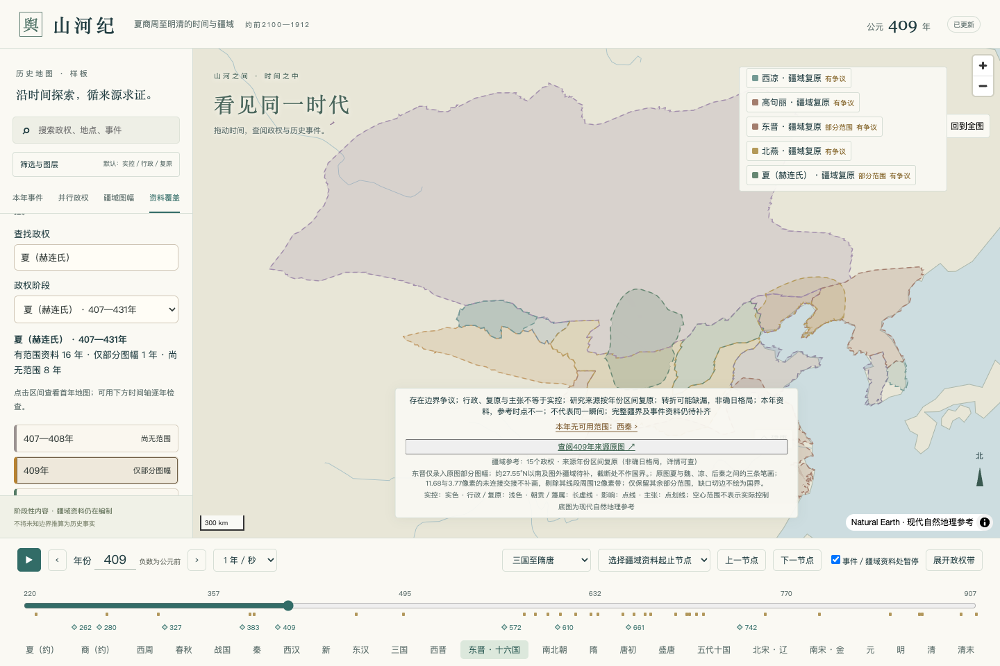
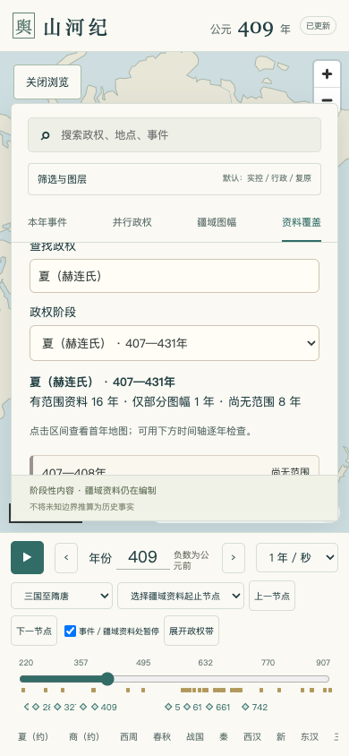

# 逐年缺口继续补入：夏（赫连氏）409年 · 2026-10-07

发布版本 `74be55cc977e3ee2`。对照 `e68cd1f` 提交的正式逐年清单，新增1条唯一几何；现为593条唯一疆域／650条包内引用。9个数据包、99个政权、75件唯一事件／78条引用、17个地点、77个来源及12张来源原图保持。

## 实际变化

| 政权—年份         | 此前     | 本轮                       | 剩余缺口                                      |
| ----------------- | -------- | -------------------------- | --------------------------------------------- |
| 夏（赫连氏）409年 | 尚无范围 | 原图部分范围，保留边线缺口 | 407—408、426—431年仍无范围；409年仍非完整轮廓 |

该阶段统计由“16年有范围、0年部分、9年缺失”变为“16年有范围、1年部分、8年缺失”。此处统计的是资料存在性，不是完整年度实控疆界。

全图仍为3331年有任一范围、681年无范围；409年原本已有其他政权资料，因此不减少全图空白年份。4012个年份、105个登记名称阶段重新核对通过。此前649条疆域引用与78条事件引用结构完全保持，没有删改既有数据。对比结果见 [本轮差异审计](../../data/audits/annual-gap-progress-xia409-2026-10-07.json)，此前同日四条范围的进度文件保留。

## 来源、身份与年代

采用Zunkir的 [Seize Royaumes 409.svg](https://commons.wikimedia.org/wiki/File:Seize_Royaumes_409.svg)，2016-10-02 13:51 UTC原SVG，2000×1335；沿用已收录的原文件及SHA-256：`33e9f1ed791607e9532b8fc8edd92961b56f0a9ae6465d2da6c3bf9591166beb`。原图说明为409年中国北方，原图`text3262-7`标注`Xia`，对应目录的夏（赫连氏），不对应夏代或西夏。

作者Zunkir，底图Kanguole；原图及本项目派生部分轮廓采用 [CC BY-SA 4.0](https://creativecommons.org/licenses/by-sa/4.0/)，保留署名、来源及修改说明，不暗示原作者认可本项目。文件与署名索引见 [Commons说明](../../data/sources/commons/README.md)。本轮不新增或修改原SVG。

原图所据Xiong书目尚未逐页独立核验。本次agent核对身份、轮廓与坐标转换，不能代替历史专家审定；不将其声明为全年实际控制。

## 边线缺口处理

采用原图`path3129`、`path3133`、`path3886`中围绕`Xia`标签的明确笔画区段，原图其他政权标签作为排除检查。只保留所标409年，不延用407、408年或其他年份。

| 交接                   |  中心线距离 | 处理                                  |
| ---------------------- | ----------: | ------------------------------------- |
| `path3129`／`path3133` | 11.6794像素 | 超出3像素门槛，剔除交接与周围12像素带 |
| `path3133`／`path3886` |  1.2014像素 | 沿既有门槛保留已复核短交接            |
| `path3886`／`path3129` |  3.7712像素 | 超出门槛，剔除交接与周围12像素带      |

没有放宽已有3像素交接门槛。几何闭合计算用的两条较大连接线及周围区域从填色中剔除；剔除区的切边也从显示边线移除，不能绘为历史国界。累计移除611.7391平方像素，使用`partial-source`明确标记。12像素为本轮保守排除范围，不是历史边界精度。

按同源底图声明的等距圆柱投影及117%南北伸长转换，不作城市点拟合。沿用并重新执行四湖独立检查，最大自然地理残差约3.21公里；不是历史疆界精度。提取不自动修复无效多边形，不按现代国界裁切。登记见 [提取配置](../../data/registration/xia-409-partial.json)，检查见 [几何审计](../../data/audits/xia-409-partial-intake.json)。

## 本轮继续保留的候选缺口

- **409年西秦**：已有原图新增`path3145`与旧`path3903`南段同时保留，内部分界归属仍未解决；本轮没有据文字标签猜测外轮廓。
- **395年东晋图**：本轮通过Commons API复核[395年文件](https://commons.wikimedia.org/wiki/File:Seize_Royaumes_395.svg)最新描述，仍写`vers 327`，同时描述前秦灭亡后的格局；文件名与年代说明矛盾未澄清，不能只据文件名编制395年快照。
- **约700年图**：[来源说明](https://commons.wikimedia.org/wiki/File:Tang_Dynasty_circa_700_CE.png)写约700年，但所据图幅为约750年，还含715—766、670—692、692—790等时段注释；继续不用于填满690—705年武周年度缺口。
- **夏407—408、426—431年**：仍需对应年代的独立范围资料，不延用409年或原410—425年区间。

逐年剩余清单见 [正式查询清单](annual-query-sweep.md)。有部分来源轮廓不表示任何年份完整；全球与完整周边仍未完成。

## 页面验收

201项单元／组件测试、26项Python几何检查通过；两项针对性Chrome端到端检查通过，覆盖本轮409年夏的绘制、清单同步、手机原图，以及原晋代四条范围的共同绘制和邻年撤图。此处没有重跑全量26项端到端测试。

生产4174预览检查407、408、409、410、426年，新增快照只在409年绘制；409年清单显示16年有范围、1年部分、8年缺失，西秦仍为缺口。2000×1335原SVG及许可说明可查阅，页面与资源errors为空。记录见 [生产检查](../qa/xia-409-partial-check.json)。





## 复现

```sh
.venv/bin/python scripts/data/import_xia_409_partial.py --apply
node --import tsx scripts/data/publish.ts
node --import tsx scripts/data/annual_sweep.ts --checked-at 2026-10-07
.venv/bin/python scripts/data/audit_coverage.py --checked-at 2026-10-07
.venv/bin/python scripts/data/compare_annual_gaps.py --baseline-ref e68cd1f --checked-at 2026-10-07 --output data/audits/annual-gap-progress-xia409-2026-10-07.json
node scripts/qa/verify-xia-409-partial.mjs
```
